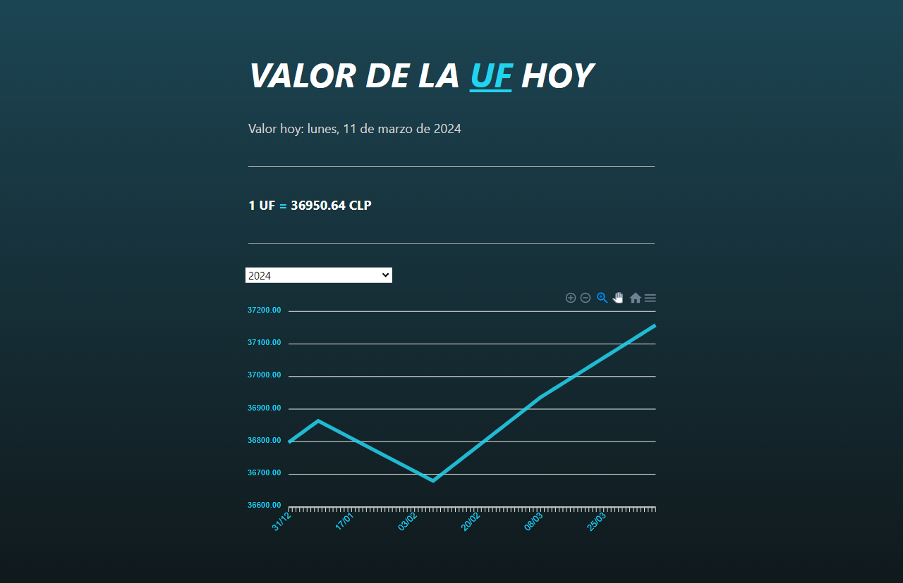
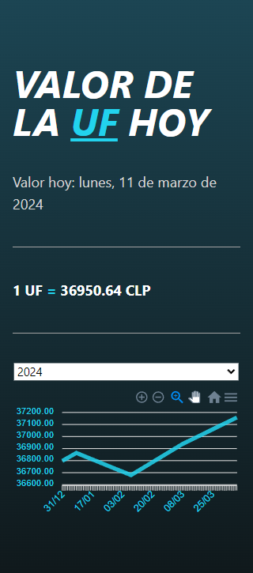

<h1 align="center">Laravel + Vue.js UF</h1>

<p align="center">Aplicación sencilla para mostrar los valores de la Unidad de Fomento a CLP</p>
<p align="center">Laravel 10 (PHP 8.2>) y VueJS 3 (Node 18>)</p>

## Screenshots

<div class="row">
    Desktop
  <div class="column">
    
  </div>
    Mobile
  <div class="column">
    
  </div>
</div>

## Cómo utilizar

#### Clona el repositorio

```bash
git clone
```

#### Copia .env.example el archivo a .env y edita las credenciales (BBDD)

#### Instala Composer

```bash
composer install
```

#### Genera la Key de la aplicación

```bash
php artisan key:generate
```

#### Migra la BBDD

```bash
php artisan migrate
```

#### Instala dependencias para los paquetes de Vue

```bash
npm install

npm run dev
```
